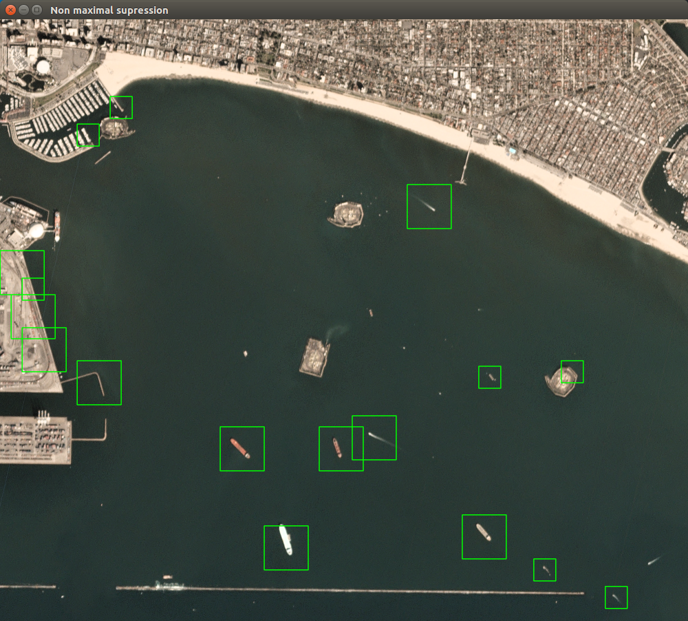

# Ship Detection from Satellite Imagery

This is a ship detection pipeline for the [Ships in Satellite Imagery Dataset](https://www.kaggle.com/rhammell/ships-in-satellite-imagery) from Kaggle. It uses Sliding Windows + Non maximal supression for the object detection with a HoG + SVM approach for classification.

## Scripts

### Classifier

A HoG + SVM classifier is trained using the information contained in the dataset compressed file and stored in pickle format.

```
python ship_clf.py
```

### Sliding Window Object Detection

The ship detector slides a window across an image pyramid and classifies each window as ship or not ship returning a set of bounding boxes that are filtered afterwards using a non maximal supression scheme. 

```
python ship_detector.py
```

